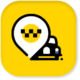
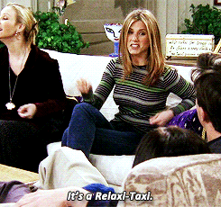
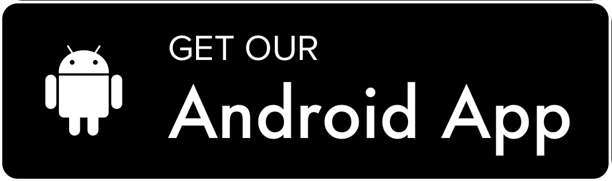

 

  

  
<h1 align="center">
 🏁 Relaxi Taxi 🏁
  </h1>
  
  
  
  
    
 

Relaxi is an online taxi booking app, developed by flutter & dart language. It's an easy, fast and safe way to order a taxi "Rider App" or to sign up as a driver and transport people to their destination "Driver App".
 
  <h3 align="center" >
  Not just a Taxi... It's Relaxi ^_-  
  
   </h3> 
  
 
 ## Supported Platforms 📱
 

  <table width="auto" align="center" >
  <tr>
<td> OS </td>
   <td> Status </td> 
   </tr>
    <tr>
<td> Android </td>
     <td align="center"> 
     Tested And Works Fine
     </td> 
   </tr>
    <tr>
<td> iOS </td>
   <td> Not yet compatible </td> 
  </tr>
   
  </table >

 ## App Preview 👁️‍🗨️
 

  
 

## Support 💛

## Reviews & Suggestions 💌
Send me your opinion or suggestion anonymosly on:  

